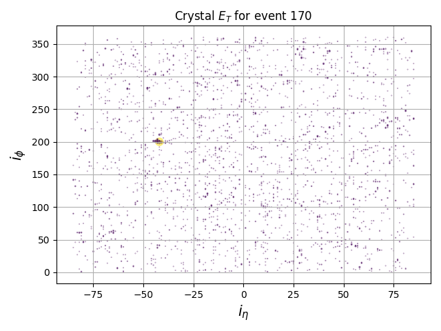

Installation:

```
git clone https://github.com/SridharaDasu/CMS-HLLHC-Calo-TPGs.git
cd CMS-HLLHC-Calo-TPGs
virtualenv --python python3 venv
source venv/bin/activate
pip3 install --upgrade pip
pip3 install -r requirements.txt
```

Data:

Directory crystal_data contains the data for a sample set of events

Data distribution plots

```
python plot_crystal_et.py
```


